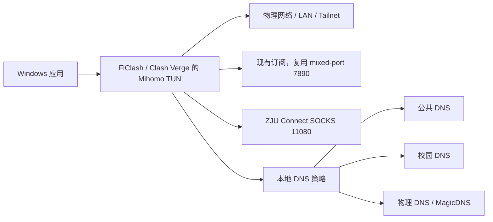

# zjunet-skill

这是我们在 Windows 上组合物理网络、现有代理订阅、ZJU Connect、条件 DNS、TUN 和 Tailnet 后得到的脱敏经验包。

它的用途是把仓库链接直接交给另一个人或 AI，让对方先理解设计，再根据目标机器补齐本地信息并复刻。仓库保存框架、关键配置和关键脚本，不保存任何机器快照。

> 仓库不包含账号、密码、订阅 URL、代理节点、真实校园 DNS/内网地址、机器 GUID、用户目录、客户端数据库、日志、抓包或恢复包。

## 整体结构



关键思路：

- 不读取或复制订阅内容，只使用代理客户端已经提供的本地端口。
- ZJU Connect 只提供校园 SOCKS，不再开启第二套 TUN、自动路由和 DNS 劫持。
- DNS 先判断命名空间，得到地址后再决定业务流量走 DIRECT、现有代理还是校园 SOCKS。
- 普通域名先询问公共 DNS；只有公共上游都明确返回 NXDOMAIN/NODATA 时，才尝试校园 DNS。
- VPN 启动域名、物理 LAN 和 Tailnet 必须绕过校园链路，防止启动回环。
- `doctor` 只读；`doctor fix` 只恢复配置中明确列出的用户态进程，不改驱动、Core、端口范围、路由或防火墙。

## 交给 AI 的入口

让 AI 先读 [AGENTS.md](AGENTS.md)，然后运行：

```powershell
pwsh -NoProfile -File .\scripts\Get-NetworkInventory.ps1
pwsh -NoProfile -File .\bootstrap.ps1 plan
```

AI 应明确告诉用户还要在本机补充什么。通常只有：

- ZJU 用户名与本地隐藏输入的密码；
- 校园 DNS、校园网段和需要校园解析的域名后缀；
- 一个无敏感信息的校园验证页面；
- 若代理客户端没有可用配置，在客户端 GUI 内本地导入订阅。

密码和订阅不得发到聊天里。

## 构建，而不只是看图

复制示例配置到被 Git 忽略的 `local` 目录，补齐本机参数：

```powershell
New-Item -ItemType Directory .\local -Force
Copy-Item .\config\topology.example.json .\local\topology.local.json
pwsh -NoProfile -File .\bootstrap.ps1 build -ConfigPath .\local\topology.local.json
pwsh -NoProfile -File .\bootstrap.ps1 smoke -ConfigPath .\local\topology.local.json
```

构建会生成：

- `out/managed-overlay.js`：交给 FlClash / Clash Verge 的托管脚本；
- `out/conditional-dns.json`：条件 DNS 解析器所需的无凭据配置；
- `out/replication-plan.json`：AI 可以逐项执行和验证的本机计划。

仓库只交付条件 DNS 的接口合同和配置生成，不包含解析器程序本身。复刻者需要按 [条件 DNS 合同](docs/replication-guide.md#6-条件-dns) 实现或接入已有解析器；`smoke` 只检查本地监听器，不等同于完整端到端验证。

完整落地顺序见 [复刻指南](docs/replication-guide.md)。

## 日常命令

```powershell
pwsh -NoProfile -File .\scripts\zjunet.ps1 status
pwsh -NoProfile -File .\scripts\zjunet.ps1 doctor
pwsh -NoProfile -File .\scripts\zjunet.ps1 doctor fix
pwsh -NoProfile -File .\scripts\zjunet.ps1 capture-udp
```

`doctor fix` 需要本机 `local/runtime.local.json`，并且只会启动其中列出的、已经存在的用户态程序。它不会自动提权，也不会修改网络内核设置。

## 文档

- [网络与 DNS 架构](docs/architecture.md)
- [从仓库链接复刻到新机器](docs/replication-guide.md)
- [状态、离线恢复与 UDP 4266](docs/operations.md)

哔哩哔哩等多资源页面适合作为综合验证样本，因为一次页面访问会覆盖 HTML、API、脚本、图片和媒体等多种传输；这些域名只是探针，不是路由白名单。
