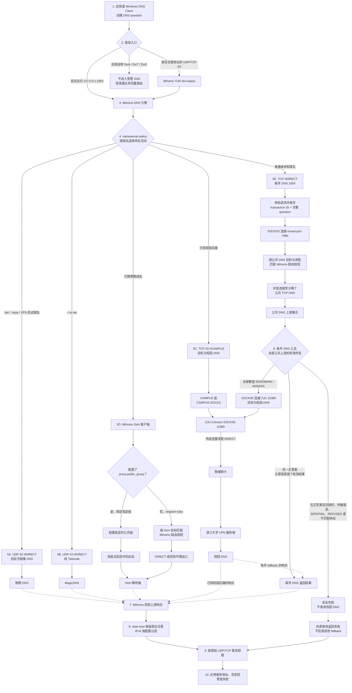
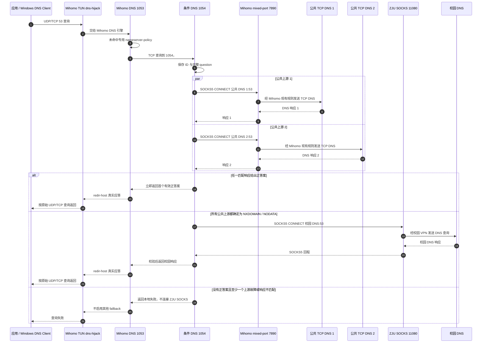
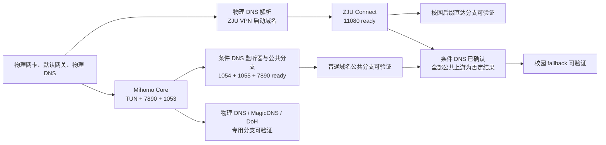
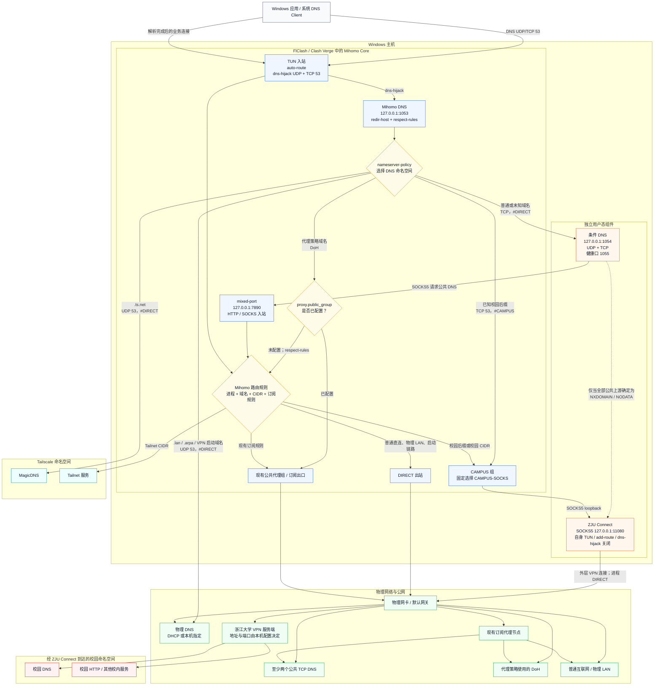
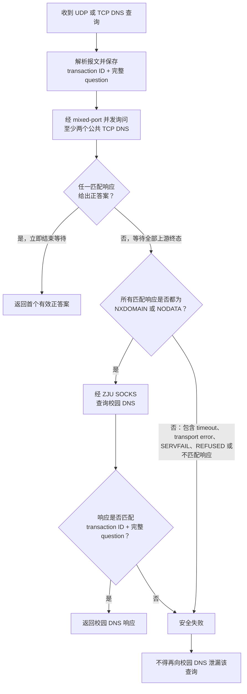
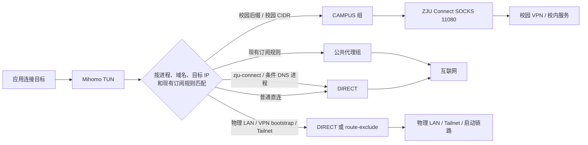
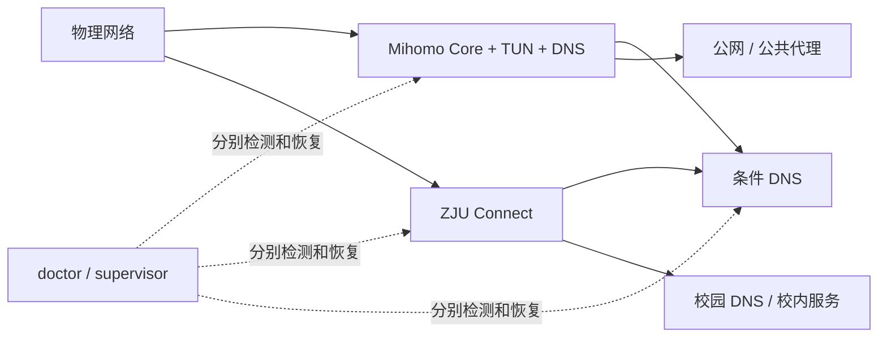

# 网络与 DNS 架构

这套设计只有一个 TUN 和一个 DNS 策略入口。Mihomo 先按域名所属的命名空间选择解析链路，拿到地址后，再用域名、目标 IP、进程和已有订阅规则选择业务出口。校园 DNS、公共 DNS、物理 DNS、MagicDNS 和代理 DoH 不是一个无序的 fallback 池。

图中的端口是 `config/topology.example.json` 的默认值，目标机器可以在本地配置中修改。除非特别标出，箭头表示请求方向，响应沿原路径返回。

## 先明确 DNS 的管理边界

这套方案管理的是进入 Mihomo 的传统单播 DNS。`dns-hijack: any:53` 和 `tcp://any:53` 只接管 UDP/TCP 53，不会自动拆解应用自己发出的加密 DNS。

| 入口 | 谁监听或接管 | 正常用途 | 下一跳 |
|---|---|---|---|
| 应用发往任意服务器的 UDP/TCP 53 | Mihomo TUN 的 `dns-hijack` | 日常系统 DNS | Mihomo DNS 引擎 |
| `127.0.0.1:1053` | Mihomo DNS | 本机显式查询或诊断 | 同一个 Mihomo DNS 引擎 |
| `127.0.0.1:1054`，UDP/TCP | 条件 DNS | 独立验证条件解析器 | 公共 DNS 分支，严格满足条件后才进入校园分支 |
| `127.0.0.1:1055` | 条件 DNS 的健康接口 | 只证明进程的健康端点存在 | 不承载 DNS 查询 |
| 应用自带 DoH、DoT、DoQ | 对 Mihomo 来说是普通 HTTPS/TLS/QUIC 业务流量 | 不经过本文的 `nameserver-policy` | 由普通业务规则决定出口 |
| mDNS、LLMNR、NBNS | 不属于 53 端口单播 DNS | 局域网名字发现 | 不在当前模板的管理范围内 |

所以，“TUN 已开启”不等于所有名字解析都经过 1053。若目标要求禁止应用私有 DoH/DoT 泄漏，需要另行增加阻断或端点策略；当前仓库没有声明这项能力。

Mihomo 受管 DNS 的关键配置关系是：

- `nameserver` 和 `direct-nameserver` 都指向 `tcp://127.0.0.1:1054#DIRECT`；普通域名和需要直连的业务域名不会因为业务出口不同而偷偷换一套默认 DNS。
- `nameserver-policy` 只对明确的命名空间改道，包括物理 DNS、MagicDNS、校园 DNS 和代理 DoH。
- `respect-rules: true` 让没有显式绑定代理组的 DoH 连接继续遵守 Mihomo 路由规则。
- `fallback: []`，同时要求前端关闭 `append system DNS`，因此不存在隐藏的系统 DNS fallback。
- `enhanced-mode: redir-host` 返回上游给出的真实地址，不使用 Fake-IP 池。
- `ipv6: false` 关闭这条受管 DNS 链路的 IPv6 应答；需要 IPv6 时必须同时重审 DNS、TUN、CIDR 和上游可达性。

## DNS 查询的完整逐跳流程

下面这张图只画 DNS，不混入解析完成后的网页或其他业务连接。实线是查询方向，虚线是 DNS 响应回程。所有响应最终都回到 Mihomo DNS，再按原始 UDP/TCP 查询返回给应用。

这个总流程中，只有 `RESULTS → CFALLBACK` 是“先公共、后校园”。已知校园后缀从一开始就选择校园 DNS；物理命名空间、Tailnet 和代理策略域名也各走各的专用解析器，互相不会 fallback。

## 五条解析分支逐条说明

### 1. 物理 DNS 与 VPN bootstrap

1. 应用的 53 端口查询被 TUN 接管，进入 Mihomo DNS。
2. 查询名命中 `.lan`、`.arpa` 或 `vpn_bootstrap_names` 中的精确名称。
3. Mihomo 使用配置中的物理 DNS IP，发送 UDP 53，并用 `#DIRECT` 强制绕过公共代理和校园代理。
4. 报文从物理网卡发出，响应直接回到 Mihomo DNS，再回到原应用。
5. 这条路径不会经过 1054、7890 或 11080。它必须在 ZJU Connect 尚未建立时就可用，否则 VPN 服务端本身无法解析，形成启动回环。

### 2. Tailnet 与 MagicDNS

1. `+.ts.net` 命中单独的 `nameserver-policy`。
2. Mihomo 向本机配置的 MagicDNS 发送 UDP 53，并绑定 `#DIRECT`。
3. 查询和响应经过 Tailscale 命名空间，不进入条件 DNS、公共代理或校园 VPN。
4. 得到地址以后，访问 Tailnet 服务的业务连接仍需命中 Tailnet CIDR 的 DIRECT 或 route-exclude 规则；DNS 走对并不自动保证业务路由走对。

### 3. 已知校园后缀

1. 校园后缀在 Mihomo DNS 的第一次分类中直接命中，不先询问公共 DNS。
2. Mihomo 创建到校园 DNS 的 TCP 53 查询，并用 `#CAMPUS` 绑定 `CAMPUS` 组。
3. `CAMPUS` 组固定选择本机 `CAMPUS-SOCKS`，也就是 ZJU Connect 的 `127.0.0.1:11080`。
4. ZJU Connect 把“连接校园 DNS:53”的 SOCKS5 请求装入校园 VPN。ZJU Connect 自身的外层连接按进程规则 DIRECT，经物理网卡到 VPN 服务端。
5. 校园 DNS 响应沿 VPN → ZJU SOCKS → CAMPUS 出站 → Mihomo DNS 原路返回。
6. 这条路径不会接触条件 DNS、mixed-port 或公共 DNS。若校园链路故障，它应直接失败，不能把内部名字泄漏给公共解析器。

### 4. 代理策略域名与 DoH

1. 域名命中 `geosite:gfw` 等代理 DNS 策略后，Mihomo 使用 `proxy_doh` 中的 DoH URL。
2. 若 `proxy.public_group` 非空，生成的 nameserver 会显式附加 `#公共代理组`；DoH 连接固定从该组出去。
3. 若没有指定组，nameserver 不附加组名，因为 `respect-rules: true`，DoH 连接由现有 Mihomo 规则选择 DIRECT 或订阅代理。
4. DoH 的 HTTPS 响应回到 Mihomo DNS 后，再作为普通 DNS 应答返回应用。
5. 这条路径不进入条件 DNS，也不会因 DoH 失败而查询校园 DNS。

### 5. 普通或未知域名

普通域名是唯一进入条件 DNS 状态机的分支。`nameserver` 与 `direct-nameserver` 都使用这条链路，所以“业务最终 DIRECT”与“业务最终 PROXY”不会改变下面的 DNS 顺序。

“所有公共上游都确定不存在”是一个全称条件：

- `NXDOMAIN + NXDOMAIN` 可以进入校园 fallback。
- `NXDOMAIN + NODATA` 可以进入校园 fallback。
- `NXDOMAIN + timeout` 不可以。
- `NODATA + SERVFAIL` 不可以。
- `REFUSED + transport error` 不可以。
- transaction ID 或完整 question 不匹配的响应不可以被当作有效否定回答。

首个正答案可以提前结束客户端等待；其余并发请求是取消还是仅忽略迟到响应，由条件 DNS 实现决定，但迟到响应不能覆盖已经返回的答案。

公共 DNS 这条链路没有使用 `proxy.public_group`；该字段只绑定代理 DoH。条件 DNS 先以 SOCKS5 客户端身份进入 7890，再由 Mihomo 规则决定公共 DNS 目标的实际出口。生成模板把 `PROCESS-NAME,conditional-dns.exe,DIRECT` 放在规则顶部，因此使用这个文件名时预期出口是 DIRECT；若本机实现换了可执行文件名，必须同步进程规则并重新验证出口，否则这条链路可能落到订阅规则的其他出口。

## DNS 响应如何回到应用

每条成功路径都必须完成两层对应关系：

1. 上游响应对应当前发出的上游请求。条件 DNS 必须核对 transaction ID 和完整 question；校园 fallback 的响应也适用同样校验。
2. Mihomo DNS 把上游结果对应回被 TUN 劫持或显式发到 1053 的原查询，并使用原查询的 UDP/TCP 传输返回。

`redir-host` 模式下，正答案中的地址是上游返回的真实地址，不会替换为 Fake-IP。否定回答或本地失败也沿相同回程到达应用。应用和 Windows DNS Client 是否按 TTL 缓存属于客户端行为，不改变上游选择规则；不能依靠缓存掩盖任一分支不可达。

显式直接查询 1054 是例外：它绕过 Mihomo 的命名空间分类，条件 DNS 会把结果直接返回测试客户端。这种测试只能证明条件分支，不能证明 53 端口劫持、1053、校园后缀直达、MagicDNS 或代理 DoH。

## 启动依赖与就绪顺序

端口监听不等于 DNS 已就绪。合理的证明顺序是：

1. 物理网络和物理 DNS 可用，VPN 启动域名可在无 VPN 状态下解析。
2. Mihomo Core 已打开 TUN、7890 和 1053，并加载当前 overlay。
3. ZJU Connect 已通过物理链路建立外层连接，11080 可完成 SOCKS5 握手。
4. 条件 DNS 已打开 1054/1055，并能通过 7890 到达多个公共 TCP DNS。
5. 分别验证物理、MagicDNS、校园后缀直达、代理 DoH、普通域名正答案和严格校园 fallback；不能用一个公共域名成功代替全部分支。

## DNS 结果或故障会影响哪里

| 结果或故障点 | 仍可能工作的 DNS 分支 | 实际行为或受影响分支 | 禁止的错误恢复 |
|---|---|---|---|
| 条件 DNS 1054 停止 | 物理 DNS、MagicDNS、已知校园后缀、代理 DoH | 普通或未知域名 | 不得把系统 DNS 自动追加为 fallback |
| mixed-port 7890 不可用 | 物理 DNS、MagicDNS、已知校园后缀；代理 DoH 是否可用取决于其出口 | 条件 DNS 的公共查询 | 不得因传输失败转问校园 DNS |
| 单个公共 DNS 超时 | 其他上游给正答案时仍可成功 | 若无正答案，则不能进入校园 fallback | 不得把“部分否定 + 部分故障”当作全部否定 |
| 所有公共 DNS 都明确 NXDOMAIN/NODATA | 专用分支不受影响 | 条件 DNS 转入校园查询 | 这是唯一允许的校园 fallback，不是故障修复 |
| ZJU SOCKS 11080 或 VPN 失效 | 公共正答案、物理 DNS、MagicDNS、代理 DoH | 已知校园后缀和条件校园 fallback | 不得把校园名字泄漏给公共 DNS，也不得重启无关 Core |
| 物理 DNS 失效 | 已经不依赖物理 DNS 的部分运行中分支可能暂时可用 | VPN bootstrap、`.lan`、`.arpa` | 不得用校园 DNS 解析 VPN 服务端形成回环 |
| 代理 DoH 出口失效 | 物理、MagicDNS、校园和条件公共分支 | 代理策略域名 | 不得自动改走校园 DNS |
| Mihomo DNS 1053 或 TUN 劫持失效 | 显式查询 1054 可能仍成功 | 日常受管 DNS 总入口 | 不得把 1054 成功误报为整套 DNS 成功 |

## 完整部署拓扑

这张图有几条容易被简图掩盖的路径：

- Mihomo 的默认 DNS 上游不是公共 DNS，而是本机条件 DNS；`#DIRECT` 在这里表示访问 loopback 时不再进入代理选择，不表示条件 DNS 的外部查询一定裸直连。
- 条件 DNS 访问公共解析器时显式连接 mixed-port，再由 Mihomo 规则决定出口。模板中的 `conditional-dns.exe` 进程规则优先选择 DIRECT；实现文件名改变时必须同步该规则。
- 已知校园后缀不会先问公共 DNS。Mihomo 直接把校园 DNS 查询绑定到 `CAMPUS` 出站，经本机 ZJU SOCKS 进入校园 VPN。
- 普通域名只有在所有公共上游都返回确定的不存在结果时，才由条件 DNS 连接 ZJU SOCKS 查询校园 DNS。超时和上游故障不能被解释成“域名只存在于校园网”。
- `+.ts.net`、物理 LAN 与 VPN 启动域名各自有独立的 DIRECT 路径，不依赖条件 DNS 或校园 VPN。

## DNS 选择矩阵

| 查询类别 | Mihomo 选择 | 本机下一跳 | 外部解析器 | 是否进入条件 fallback |
|---|---|---|---|---|
| `.lan`、`.arpa`、VPN 启动域名 | `nameserver-policy` + `#DIRECT` | 物理网卡 | 物理 DNS | 否 |
| `+.ts.net` | `nameserver-policy` + `#DIRECT` | Tailscale | MagicDNS | 否 |
| 已知校园后缀 | `nameserver-policy` + `#CAMPUS` | CAMPUS 组 → ZJU SOCKS | 校园 DNS | 否，直接走校园链路 |
| 代理策略域名 | 代理 DoH | 指定公共代理组；未指定时遵守现有规则 | 配置的 DoH | 否 |
| 普通或未知域名 | 默认 nameserver + `#DIRECT` | 条件 DNS 1054 | 先公共 TCP DNS，满足严格条件后才问校园 DNS | 是 |
| 对条件 DNS 的显式健康测试 | 直接访问 1054 | 条件 DNS | 与上一行相同 | 是，且必须分别测 UDP/TCP |

## 条件 DNS 状态机

条件 DNS 是一个有明确终止条件的解析器，不是“公共 DNS 失败就问校园 DNS”的普通 fallback。它必须同时接受 UDP 和原始 TCP DNS；Mihomo 的生产链路默认用 TCP 访问它，验证矩阵则要覆盖两种入站协议。

混合结果也遵守同一规则。例如一个公共上游返回 NXDOMAIN，另一个超时，不满足“全部上游均给出确定的不存在结果”，所以必须失败，不能进入校园 fallback。

## 解析完成后的业务流量

DNS 只决定从哪个命名空间取得答案。拿到地址以后，Mihomo 仍会独立进行第二次路由决策，不能把“由校园 DNS 解析”直接等同于“业务流量一定走校园 SOCKS”。

## 防回环与防泄漏边界

- `zju-connect.exe` 和条件 DNS 实现进程本身必须匹配 DIRECT 规则；本机实现若使用不同文件名，要同步修改进程规则。
- ZJU Connect 服务端的启动域名必须用物理 DNS 解析，ZJU Connect 的外层连接必须走物理网卡。否则会形成“先建立 VPN 才能解析或连接 VPN 服务端”的启动回环。
- 条件 DNS 到公共解析器只通过显式 mixed-port 入站；到校园解析器只通过显式 ZJU SOCKS 入站。不要让它自行使用 Windows 系统 DNS。
- ZJU Connect 只提供 loopback SOCKS，关闭它自己的 TUN、add-route 和 dns-hijack，避免与 Mihomo 争夺默认路由和 53 端口。
- Mihomo 的普通 `fallback` 必须为空，`append system DNS` 必须关闭。系统 DNS 不能作为隐藏的第六条上游路径。
- 物理 LAN 和 Tailnet 使用更具体的 DIRECT 或 `route-exclude-address`；公共代理节点、VPN 启动地址和本地监听器都不能依赖校园链路。
- 条件 DNS 只有在“全部公共上游确定不存在”时才接触校园 DNS。timeout、SERVFAIL、REFUSED、传输错误和不匹配响应都在本地安全失败。

## 独立故障域

校园客户端崩溃时只恢复校园客户端；条件 DNS 崩溃时只恢复条件 DNS。不要因为一个校园探针失败就替换或重启代理 Core。验证时必须分别证明物理 bootstrap、Mihomo DNS、条件 DNS UDP/TCP、公共上游、校园 SOCKS、校园 DNS、MagicDNS、LAN/Tailnet 绕过和解析后的业务链路。
