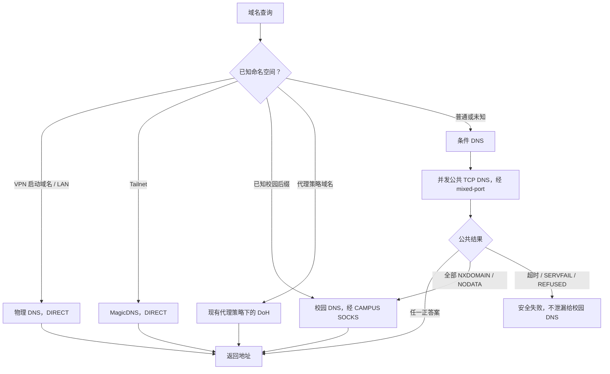
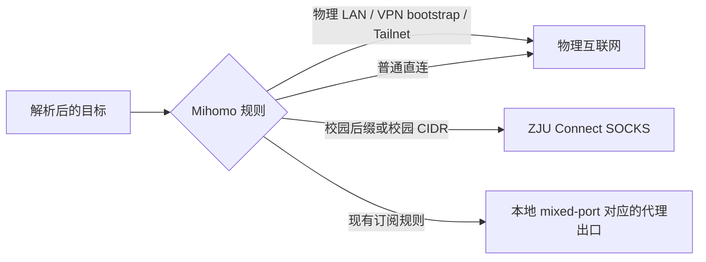
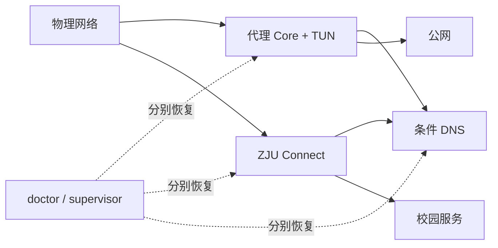

# 网络与 DNS 架构

## 两阶段决策

DNS 负责确定目标属于哪个命名空间；得到地址以后，Mihomo 规则再决定业务流量走哪条链路。不要把校园 DNS、公共 DNS 和代理 DoH 混成无序 fallback 池。

## 业务流量

## 防回环边界

- `zju-connect.exe` 和条件 DNS 进程本身必须 DIRECT。
- VPN 服务端的启动域名必须使用物理 DNS，在 VPN 建立前可解析。
- 物理 LAN 和 Tailnet 使用更具体的 DIRECT/route-exclude 规则。
- ZJU Connect 只提供 SOCKS，关闭它自己的 TUN、add-route 和 dns-hijack。
- 条件 DNS 到公共解析器的连接进入本机 mixed-port；到校园解析器的连接进入校园 SOCKS。

## 独立故障域

校园客户端崩溃时只恢复校园客户端；条件 DNS 崩溃时只恢复条件 DNS。不要因为一个校园探针失败就替换或重启代理 Core。
