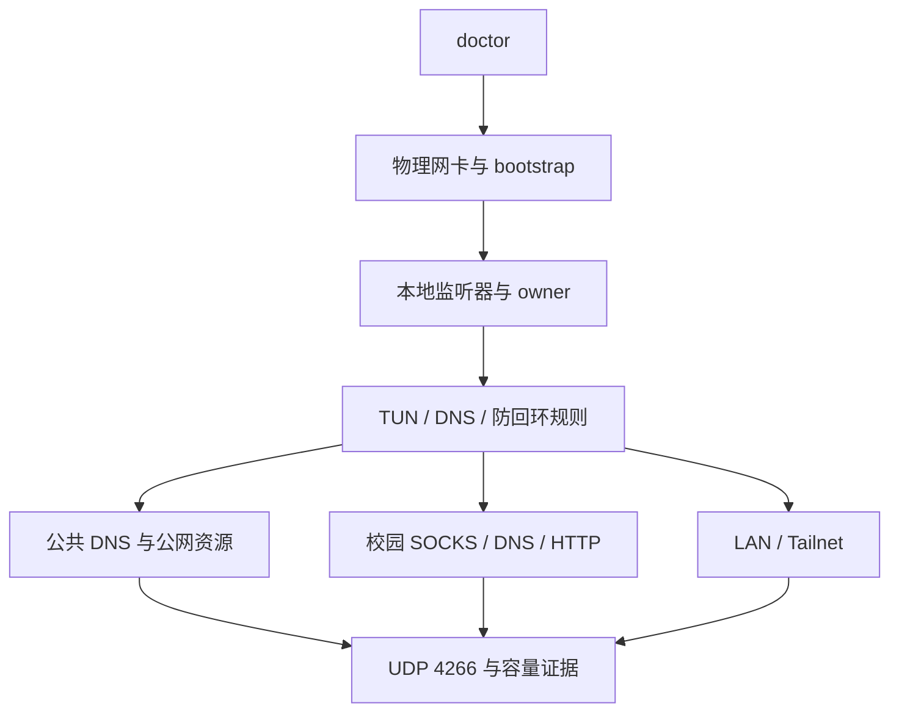

# 状态、离线恢复与 UDP 4266

## 状态和 doctor



`status` 给出当前分支状态；`doctor` 增加修复建议。二者都只读。

## doctor fix 的边界

`doctor fix` 使用本机 `local/runtime.local.json`，示例结构：

```json
{
  "components": [
    {
      "name": "campus-client",
      "executable": "<LOCAL_PATH>",
      "arguments": ["<LOCAL_ARGUMENTS>"],
      "port": 11080
    },
    {
      "name": "conditional-dns",
      "executable": "<LOCAL_PATH>",
      "arguments": ["<LOCAL_ARGUMENTS>"],
      "port": 1054
    }
  ]
}
```

这个文件被 `.gitignore` 排除。修复脚本只启动缺失的用户态组件，不自动提权，不替换 Core，也不修改驱动、动态端口范围、路由、防火墙或注册表网络策略。

要恢复复杂 DNS，应在本机另存一份不含凭据的 last-known-good 配置和哈希。恢复顺序是：验证本地包、恢复生成配置、恢复精确物理网卡的原 DNS 模式、启动用户态组件、做本地证明，最后才做外网探针。外网不可用不等于本地恢复失败。

## ZJU Connect 崩溃

进程崩溃但凭据仍可用时，可以只重启 ZJU Connect，并验证 11080 的 SOCKS5 握手。不得顺带重启代理 Core 或条件 DNS。凭据损坏或换了 Windows 用户时需要重新在本地输入，无法从公开仓库恢复。

## Windows UDP 4266

Event ID 4266 表示 Windows 未能从全局 UDP 动态端口空间分配临时端口。DNS 往往最先暴露症状，但 DNS 不一定是根因。

发生事件后至少保存：

- 事件时间和 RecordId；
- IPv4/IPv6 UDP 动态范围与排除范围；
- 首次采样延迟；
- 多次 UDP endpoint 快照；
- 各进程数量，并单列代理 Core 与 ZJU Connect；
- 如需归因，经过用户单独批准的有界循环 ETW。

不要通过自动扩大端口范围、定时重启或替换 Core 来掩盖问题。`scripts/zjunet.ps1 capture-udp` 只收集本机证据。
